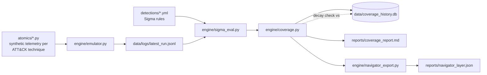

# Detection Coverage Engine

A **self-scoring purple team pipeline** that continuously proves whether your detections actually work — instead of trusting a one-time lab writeup that goes stale the moment a log field gets renamed.

> Most "I built a detection lab" projects run an attack once, write a Sigma rule, take a screenshot, and stop. In a real SOC, rules rot silently: an EDR update changes a field name, a log source stops forwarding, and a detection that worked in the demo has been dead for six months without anyone noticing. This project treats detections like code — version-controlled, tested, and re-verified on every change — and tracks coverage *over time*, not just at a single point in time.

## What it actually does

1. **Emulates 9 MITRE ATT&CK techniques** across 7 tactics by generating synthetic telemetry shaped exactly like real Sysmon/Windows Event Log output (no real attacker tooling is executed — see [Design Notes](#design-notes) for why that's a feature, not a shortcut).
2. **Evaluates your Sigma detection rules** against that telemetry using a small built-in Sigma-subset engine (`engine/sigma_eval.py`) — no external SIEM required to test a rule.
3. **Records every run to SQLite** and diffs it against the previous run to catch **coverage decay**: a technique that used to fire and silently stopped.
4. **Exports two artifacts** you can actually show someone:
   - `reports/coverage_report.md` — a per-technique pass/fail table
   - `reports/navigator_layer.json` — a real [MITRE ATT&CK Navigator](https://mitre-attack.github.io/attack-navigator/) layer file. Upload it there and you get a live red/green heatmap of your actual, tested coverage.
5. **Gates CI** — `run_pipeline.py --min-coverage 70 --fail-on-decay` returns a non-zero exit code if coverage drops below a threshold or any technique regresses, wired into `.github/workflows/detection-ci.yml`.

## Architecture



## Quickstart

```bash
git clone <your-fork-url>
cd detection-coverage-engine
pip install -r requirements-dev.txt

# Run the full pipeline
python run_pipeline.py

# Run it the way CI does (fails the build on regression or low coverage)
python run_pipeline.py --min-coverage 70 --fail-on-decay

# Run the unit tests
python -m pytest tests/ -v
```

Sample output:

```
Detection Coverage Pipeline — Run #1 @ 2026-09-14T05:42:32Z
================================================================
  [PASS] T1003.001    LSASS Memory Dump                (credential-access)
  [PASS] T1021.001    RDP Lateral Movement             (lateral-movement)
  [PASS] T1053.005    Scheduled Task Persistence       (persistence)
  [PASS] T1059.001    PowerShell                       (execution)
  [GAP ] T1070.004    Indicator Removal: File Deletion (defense-evasion)
  [PASS] T1082        System Information Discovery     (discovery)
  [PASS] T1110.001    Password Guessing                (credential-access)
  [PASS] T1486        Data Encrypted for Impact        (impact)
  [PASS] T1547.001    Registry Run Key Persistence     (persistence)
================================================================
Overall coverage: 88.9%  (8/9 techniques)
```

That `T1070.004` gap is **intentional** — no Sigma rule for it exists yet in `detections/`. It's left in on purpose to demonstrate the pipeline's real job: surfacing techniques nobody has written a detection for, not just re-confirming the ones that already work.

## Adding a new technique (the whole point of the project)

1. Create `atomics/T####_###.py` with `TECHNIQUE_ID`, `NAME`, `TACTIC`, and a `simulate()` function returning a list of log-event dicts.
2. Create a matching `detections/T####_###.yml` Sigma rule (or don't — an uncovered technique is a valid, visible state, not an error).
3. Run `python run_pipeline.py` — it auto-discovers both directories, no wiring required.

## Proving the decay-detection actually works

```bash
# Break a rule the way a real log-schema change would
sed -i 's/Image|endswith/ImageX|endswith/' detections/T1059_001.yml
python run_pipeline.py --fail-on-decay
# -> prints "⚠️ COVERAGE REGRESSION on: T1059.001" and exits 1
git checkout detections/T1059_001.yml   # restore it
```

## Design notes

**Why synthetic telemetry instead of real attack execution?** Tools like Atomic Red Team run real (if benign) attacker commands against a live Windows endpoint. That's valuable, but it also means the project only runs on a disposable Windows VM, can't run in GitHub Actions, and risks doing something you didn't intend on a real host. Generating telemetry that's *structurally identical* to what Sysmon/EDR would report exercises the exact same detection-engineering skill — reading a technique's behavior and writing a rule against its artifacts — while staying 100% safe to run anywhere, including in CI on every commit. The `atomics/` module format is intentionally close to how you'd wire in real Atomic Red Team execution later (see Roadmap).

**Why a custom Sigma subset instead of `pySigma`?** `pySigma` is built to *compile* Sigma rules into a target SIEM's query language, not to evaluate them in-process against a list of dicts. Writing the ~80-line matcher in `engine/sigma_eval.py` kept the project dependency-light and let me implement exactly the semantics I needed (including the `count()` threshold for volumetric detections like brute force). It supports `contains` / `endswith` / `startswith` / equality modifiers and single-selection conditions — a real production system should use `pySigma` for full spec compliance and multi-backend SIEM export.

## Limitations (stated honestly, not hidden)

- The Sigma matcher supports a useful subset of the spec, not the full grammar (no nested boolean conditions, no regex modifier, no multi-selection `and`/`or`).
- Telemetry is synthetic, not captured from a live endpoint — this is a detection-logic testbed, not an EDR replacement.
- `SourceIp`/`GrantedAccess`-style fields are illustrative; a production Sysmon config emits more fields than are modeled here.

## Roadmap

- Swap `atomics/` for real Atomic Red Team test execution against a disposable Windows VM, feeding real Sysmon output into the same `sigma_eval` engine.
- Add Slack/Teams webhook alerting on decay detection.
- Migrate the matcher to `pySigma` for full spec support and multi-SIEM export (Splunk SPL, KQL, etc.).
- Add a small web dashboard over `coverage_history.db` to chart coverage % over time.

## Suggested resume bullets

- *Built a self-scoring detection engineering pipeline that emulates 9 MITRE ATT&CK techniques, evaluates Sigma rules against generated telemetry, and flags detection coverage regressions — CI-gated with GitHub Actions.*
- *Designed a lightweight Sigma rule matcher (Python) supporting field modifiers and volumetric thresholds, validated with an 11-test pytest suite.*
- *Exported live coverage results as MITRE ATT&CK Navigator heatmaps, tracking detection coverage history in SQLite to catch silent rule decay before it reaches production.*

## License

MIT — use, fork, and extend freely.
